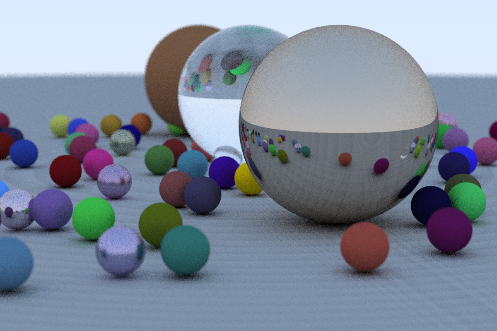

# Raytracer

Ray tracer based on Peter Shirley's book, "Ray Tracing in One Weekend".

Creates a world of spheres with different material properties: diffuse ("normal"), metal, and glass. Ray (path) traces the world and writes the results to a Portable PixMap (.ppm) file.

### Screenshots

Image created setting the constants in populateRandomWorld() to -5/5 and the number of samples to 25:

Image of the original sphere and diffuse material, where things started to get interesting:

